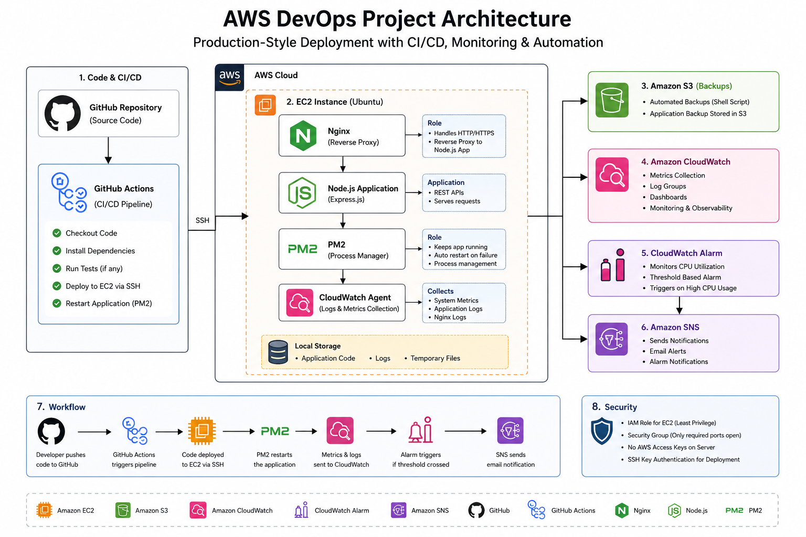
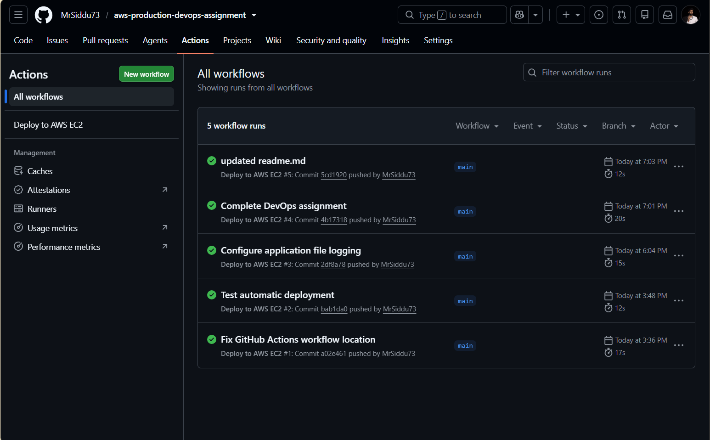
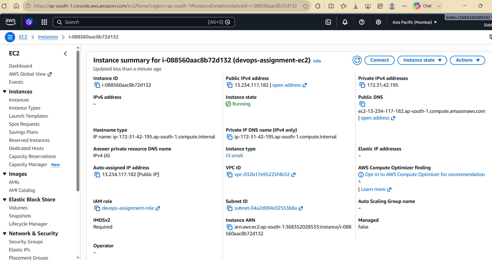
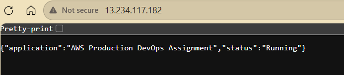
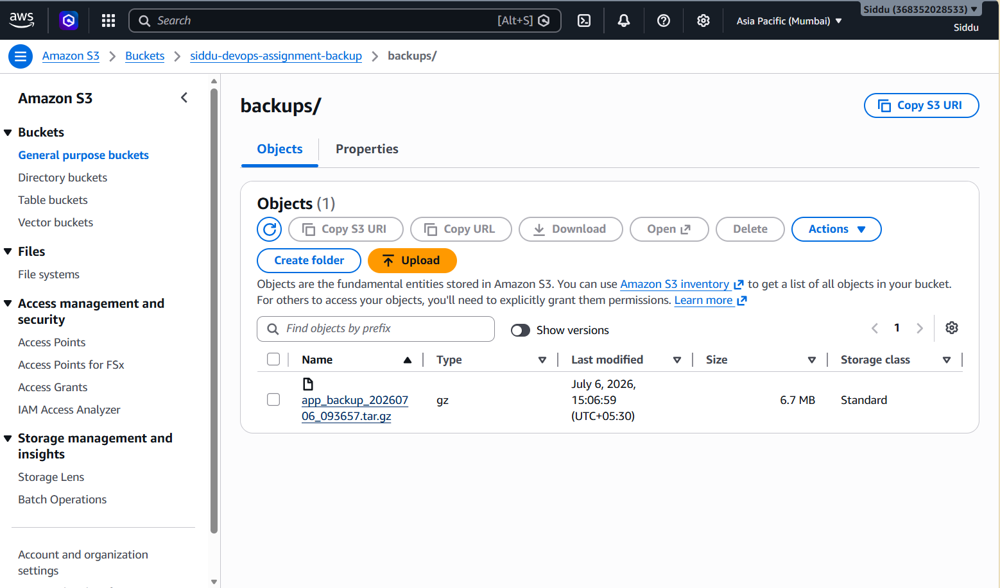
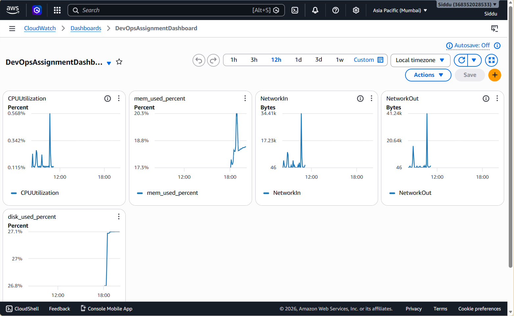

# 🚀 AWS Production DevOps Assignment

> Production-style deployment of a Node.js application on AWS demonstrating Infrastructure, CI/CD, Monitoring, Security, and Automation.


---

# 📌 Project Overview

This project demonstrates a production-oriented DevOps deployment on AWS using Free Tier services. It includes automated deployment, monitoring, backup automation, security best practices, and operational tooling commonly used in real-world environments.

---

# 🏗 Architecture



---

# 🚀 Project Highlights

- ✅ AWS EC2 Deployment
- ✅ GitHub Actions CI/CD
- ✅ Nginx Reverse Proxy
- ✅ PM2 Process Manager
- ✅ IAM Least Privilege
- ✅ Amazon S3 Backup
- ✅ CloudWatch Monitoring
- ✅ CloudWatch Dashboard
- ✅ CloudWatch Alarm
- ✅ Amazon SNS Notifications
- ✅ Shell Script Automation

---

# 🛠 Technology Stack

| Category | Technologies |
|----------|--------------|
| Cloud | AWS EC2, IAM, S3, CloudWatch, SNS |
| Backend | Node.js, Express.js |
| Web Server | Nginx |
| Process Manager | PM2 |
| CI/CD | GitHub Actions |
| Operating System | Ubuntu Linux |
| Monitoring | Amazon CloudWatch |
| Scripting | Bash |
| Version Control | Git & GitHub |

---

# 🏛 AWS Services Used

- Amazon EC2
- Amazon IAM
- Amazon S3
- Amazon CloudWatch
- Amazon SNS

---

# 📂 Project Structure

```text
aws-production-devops-assignment
│
├── .github/
│   └── workflows/
│       └── deploy.yml
│
├── app/
│
├── architecture/
│   ├── architecture-diagram.png
│   └── architecture.md
│
├── docs/
│   ├── Deployment-Guide.md
│   ├── Security-Summary.md
│   ├── Project-Report.md
│   └── screenshots/
│
├── load-testing/
│   ├── k6-test.js
│   ├── Load-Testing-Report.md
│   └── README.md
│
├── monitoring/
│   ├── cloudwatch-config.json
│   └── README.md
│
├── scripts/
│   ├── deploy.sh
│   └── backup.sh
│
└── README.md
```

---

# ⚙ Deployment Workflow

```text
Developer
     │
 Git Push
     │
GitHub Repository
     │
GitHub Actions
     │
SSH Deployment
     │
AWS EC2
 ├── Nginx
 ├── Node.js
 ├── PM2
 └── CloudWatch Agent
```

---

# 🔄 CI/CD Pipeline

The deployment pipeline is fully automated using GitHub Actions.

Workflow:

1. Push code to GitHub
2. GitHub Actions starts automatically
3. Connects securely to EC2 using SSH
4. Pulls latest source code
5. Installs dependencies
6. Restarts PM2
7. Application is updated automatically

---

# 📊 Monitoring

Amazon CloudWatch Agent collects:

### Metrics

- CPU Utilization
- Memory Usage
- Disk Usage
- Network In
- Network Out

### Logs

- Application Logs
- Nginx Access Logs
- Nginx Error Logs

### Alerts

- CPU Utilization Alarm
- Amazon SNS Email Notification

---

# 💾 Backup

Application backups are automated using Bash scripts.

Workflow:

```
Application
      │
Backup Script
      │
Compressed Archive
      │
Amazon S3 Bucket
```

---

# 🔒 Security

Implemented security best practices:

- IAM Role (Least Privilege)
- EC2 Security Groups
- SSH Key Authentication
- Nginx Reverse Proxy
- No hardcoded AWS credentials
- Amazon S3 IAM Policy

---

# 🌐 API Endpoints

| Method | Endpoint | Description |
|---------|----------|-------------|
| GET | / | Home |
| GET | /health | Health Check |
| GET | /status | Application Status |
| GET | /system | System Information |
| GET | /time | Current Server Time |
| GET | /version | Application Version |

---

# 📸 Project Screenshots

## Architecture


---

## GitHub Actions



---

## AWS EC2



---

## Application



---

## Amazon S3 Backup



---

## CloudWatch Dashboard



---

## CloudWatch Alarm


---

## CloudWatch Logs


---

# 📈 Skills Demonstrated

- AWS Cloud
- Linux Administration
- DevOps
- CI/CD
- Infrastructure Deployment
- Monitoring & Observability
- IAM Security
- Shell Scripting
- Git & GitHub
- Reverse Proxy Configuration
- Application Process Management

---

# 🚀 Future Enhancements

- Docker Containerization
- Docker Compose
- Terraform Infrastructure as Code
- HTTPS using Let's Encrypt
- Application Load Balancer
- Auto Scaling Group
- AWS Systems Manager
- Kubernetes Deployment
- Redis Caching

---

# 👨‍💻 Author

**Siddu S N**

- GitHub: https://github.com/MrSiddu73
- LinkedIn: *(Add your LinkedIn profile URL here)*

---

# ⭐ If you found this project interesting, feel free to star the repository.